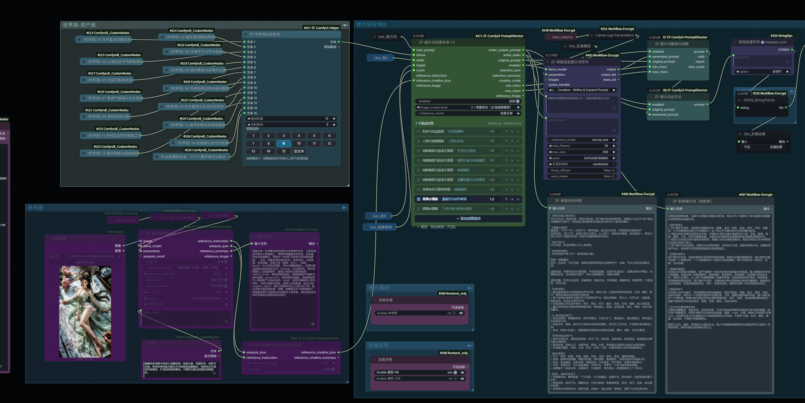
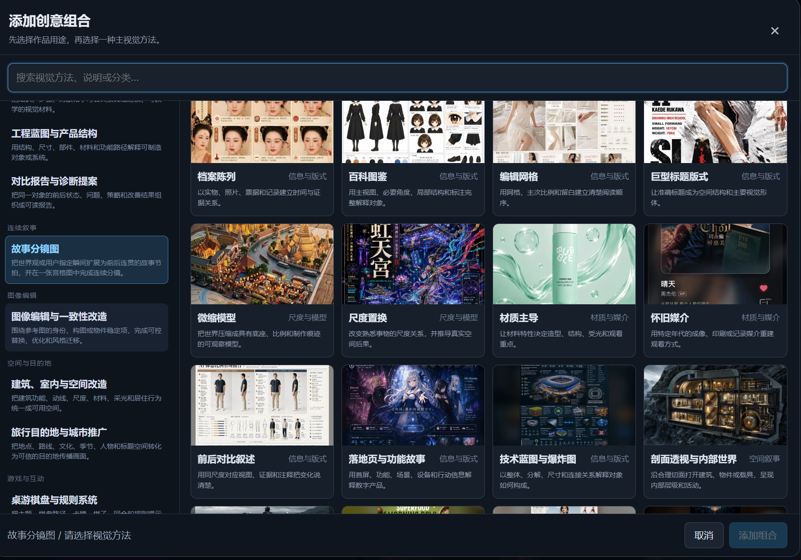
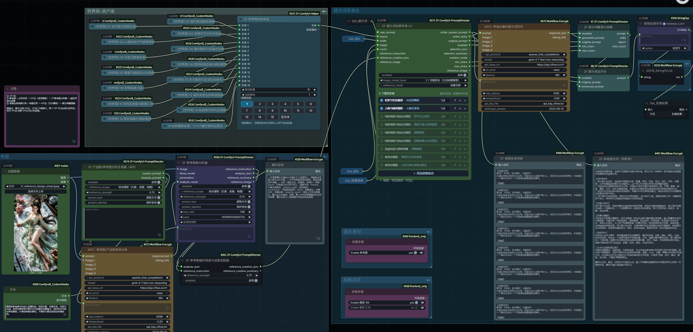

# ZF-ComfyUI-PromptDirector

[简体中文](README.zh-CN.md)

An early public-testing release of a purpose-driven prompt director for ComfyUI. It turns a user prompt, a theme/worldview, a professional use case, and a visual method into one independent Chinese image-generation task per requested image.

## Material-Source Attribution / 素材来源说明

The material catalogs used, organized, and expanded by the current and future versions of this plugin—including use cases, creative directions, case-inspired ideas, and related prompt-material references—originate from the material collections and sharing of **远古大呲花**. This attribution is included with the author's consent.

- Source author / 来源作者: **远古大呲花**
- Bilibili profile / B站主页: <https://space.bilibili.com/59550296>
- Engineering scope / 工程范围: This repository provides the plugin code and its engineering work, including structured cataloging, purpose/visual-method mapping, prompt-workflow integration, and ComfyUI node implementation. The original material source and the author's contribution remain attributed to 远古大呲花.
- Update note / 更新说明: Future additions or revisions to the material catalogs will continue to record this source. If the source arrangement changes, this section will be updated accordingly.
- Clarification / 贡献边界: This attribution identifies the material source. Unless separately agreed in writing, it does not mean that 远古大呲花 authored the plugin code or guarantees the plugin's functions, model behavior, or downstream generated content.

Feedback from different local language models, vision-language models, image models, and workflow layouts is welcome. Please open a GitHub Issue with reproducible settings and expected behavior. Do not include private images, model files, tokens, or API keys.

## Highlights

- Purpose-driven prompt planning with 31 use cases and 38 visual methods.
- Multi-image task counts are created by plugin code instead of relying on a language model to count correctly.
- User-core, theme-creation, and storyboard modes.
- Three output-detail levels for lightweight, mainstream, and strong image models.
- Dynamic reference-image creativity: extract reusable concepts, element pools, composition, materials, and lighting without feeding the source latent into the sampler.
- A temporary reference-image purpose/creative channel that can work with a worldview or the explicit empty-text route from `ZF-ComfyUI-Helper`.
- Defensive handling for incomplete VLM JSON and accidental source-image text leakage.
- Editable JSON catalogs for purposes, visual methods, worldviews, defaults, and writing grammar.

## Quick Start / 快速接法



The diagram above shows the recommended connection for the director workflow. The catalog screenshot below is the selector used to add a purpose + visual-method combination.



### Basic usage

1. Connect the user prompt to `ZF Prompt Director.user_prompt`.
2. Connect the worldview switch to `theme`. When no worldview is needed, use `ZF-ComfyUI-Helper`'s explicit empty-text route; do not rely on an old numeric route with an accidentally blank field.
3. Add one or more purpose + visual-method combinations in the director panel. The first enabled combination is normally the primary task; later combinations are supplemental.
4. Keep `reference_mode` on `创意迁移` for normal image generation. This lets reference-image creativity, the worldview, and the selected task work together.
5. Send `writer_system_prompt` and `writer_tasks` to the language-model writer, then pass the validated prompt to the existing image-generation path. Use `EmptyLatentImage` as the latent source for semantic creativity transfer.

### Storyboard is a different output mode

Choose the purpose `故事分镜图` and preferably the visual method `漫画页与动作转场`. Unlike ordinary purposes, this creates **one composite image containing all panels**, not several independent images. The `count` input is the number of valid panels: `4` → 2×2, `6` → 3×2, `8` → 3×3 with one black trailing cell. Keep the latent batch size at `1`.

The director task should contain `单张宫格分镜任务`, the panel count, and a grid such as `3列×2行`. Check this task text before blaming the image model.

Storyboard sheets are primarily for story planning, visual review, and layout reference. They are not a substitute for producing full-resolution video-reference frames; generate those frames individually when consistency and usable per-frame pixels matter.

### Common mistakes

- Do not select `参考图创意提取测试` for normal generation. It is an isolation/diagnostic mode and intentionally removes static purpose/visual combinations, so a selected storyboard will not be used there.
- Selecting only `几何分格与多焦点版式` gives a general multi-focus layout, not a continuous story sequence. Use `故事分镜图` as the purpose.
- If the task text already contains the grid instructions but the result is still a single scene, the remaining issue is image-model instruction following rather than node routing.
- For semantic reference creativity, do not connect the source-image VAE latent to `KSampler`; that changes the task into image-to-image or structural control.

## Recommended Reference-Creativity Flow

```text
LoadImage
  -> ZF Image Reference Analyzer.analysis_json
  -> ZF Reference Creative Adapter.reference_creative_json
  -> ZF Prompt Director.reference_creative_json

Worldview / empty text -> ZF Prompt Director.theme
User prompt            -> ZF Prompt Director.user_prompt
EmptyLatentImage       -> KSampler.latent_image
```

For semantic creativity transfer, do not connect the source image VAE latent to the sampler and do not connect `reference_image` unless you intentionally want IP-Adapter, ControlNet, or image-to-image structure control.

### Full API test flow



The screenshot records a successful complete run: API 1 reads the reference image and returns structured analysis, the temporary reference-purpose adapter sends it into the director, and API 2 writes the final image prompt for each task.

Use two instances of `FOK Multi-Protocol Chat Vision API` when both reference analysis and final prompt writing should use an API. They cannot be collapsed into one call because the final writer depends on the completed reference analysis:

```text
reference image ───────────────────────→ API 1.image_1
ZF reference-analysis prompt builder ──→ API 1.prompt/system_prompt
API 1.response_text ─→ ZF Image Reference Analyzer.analysis_result

Prompt Director.writer_system_prompt ─→ API 2.system_prompt
Prompt Director.writer_tasks ─────────→ API 2.prompt
API 2.response_text ─→ Prompt Validator.generated_prompt
```

`ZF Product/Reference Image Analysis Prompt Builder (API)` only creates the structured analysis request for API 1. API 2 receives no image; it turns the director's tasks into finished image-generation prompts. The two nodes may use the same provider and model, but they must remain separate calls.

The API node shown above comes from [`comfyui-FOK_API_tools`](https://github.com/facok/comfyui-FOK_API_tools). Important details:

- API 1 must use a vision-capable model. API 2 only needs text capability and all four image inputs remain empty.
- For testing, use `raise` on errors, about `4096` tokens and `0.2` temperature for analysis, then about `8192` tokens and `0.5–0.7` for final writing.
- `api_key_file` is only a local filename inside the API-node directory. Never store the key itself in a workflow or commit it.
- With xFlow's OpenAI-compatible endpoint, use `https://api.xflow.cc/v1`; when changing providers, update protocol, URL, model ID, and key file together.
- Keep analysis scope, strength, text extraction, and identity protection aligned between the prompt builder and the reference analyzer. In API mode, put additional analysis focus in the builder's `custom_focus`.

### Temporarily reusing a reverse-analysis result

The workflow includes `ZF Temporary Text Memory (cross-queue reuse)` for A/B testing:

1. Set the mode to **更新缓存 / update cache** and run API 1 (or another reverse-analysis node) once.
2. Change it to **使用缓存 / use cache**. The node returns the text saved in the current ComfyUI process and lazily skips the upstream reverse-analysis/API 1 call.
3. Select **更新缓存 / update cache** again for a new result, or **清空缓存 / clear cache** to remove it.

This is process-local temporary memory and is cleared when ComfyUI restarts. KJNodes `SetNode / GetNode` nodes are virtual frontend wiring helpers; they are useful for organizing long connections but are not cross-queue text memory. Use this node when you need to reuse the previous reverse-analysis result.

The workflow places `ZF Final Text List Memory (cross-queue reuse)` between API 2 and the prompt validator; the validator then feeds the final result display. It stores the complete multi-task prompt list rather than only the last string. Run once in update mode, then switch to use mode to lazily skip API 2 and reuse the previous full result set. The former prompt-switch, string-processing, and string-to-list branch remains available for second-pass reverse tests and compatibility.

## Installation

Clone the repository into ComfyUI's `custom_nodes` directory:

```bash
cd ComfyUI/custom_nodes
git clone https://github.com/Z-yaofang/ZF-ComfyUI-PromptDirector.git
```

Restart ComfyUI and refresh the browser.

The core prompt-director nodes use only ComfyUI-provided Python packages. The built-in reference-image analyzer is optional and requires an installed llama.cpp multimodal custom node that provides `LLAMACPPMODEL` and `LLAMACPPARAMS`. Alternatively, connect an existing VLM text result to `analysis_result`.

`ZF-ComfyUI-Helper` is recommended for its dynamic multi-route text switch and explicit empty-text route:

```bash
git clone https://github.com/Z-yaofang/ZF-ComfyUI-Helper.git
```

## Main Nodes

- `ZF Prompt Director V2`
- `ZF Image Reference Analyzer`
- `ZF Reference Creative Adapter`
- `ZF Prompt Organizer and Observer`
- `ZF Prompt Master Switch`
- `ZF Product/Reference Image Analysis Prompt Builder (API)`
- `ZF Temporary Text Memory (cross-queue reuse)`
- `ZF Final Text List Memory (cross-queue reuse)`

Legacy blueprint/task nodes remain available for workflow compatibility.

## Reference-Image Behavior

- The analyzer requests compact structured JSON and bounds its dedicated analysis temperature to `0.2`.
- If a local VLM stops before closing the JSON object, completed fields are recovered individually.
- Source-image text contributes layout, density, and stroke information but is not copied into the final image prompt unless the user explicitly requests text.
- The reference image acts as a semantic material/creative library. It is not a pixel-copy lock.

## Updating

```bash
cd ComfyUI/custom_nodes/ZF-ComfyUI-PromptDirector
git pull
```

Restart ComfyUI after an update.

## Repository Data

- `data/purposes.json`
- `data/visual_methods.json`
- `data/worldviews.json`
- `data/default_combinations.json`
- `data/writing_grammar.json`

The catalogs can be extended without rewriting the frontend selector.

## License

No open-source license has been selected yet. The repository is public for testing and review; a license can be added later by the repository owner.
