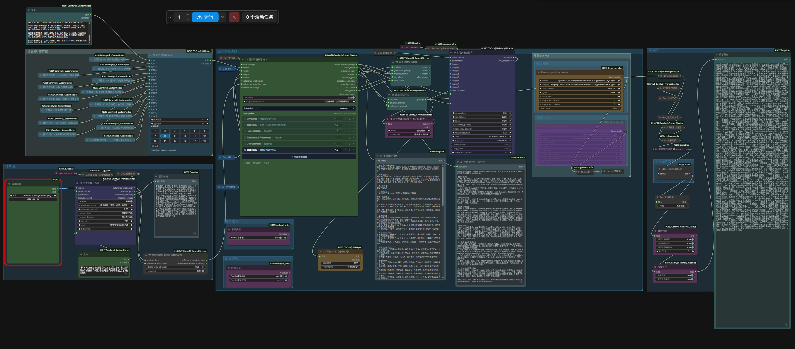
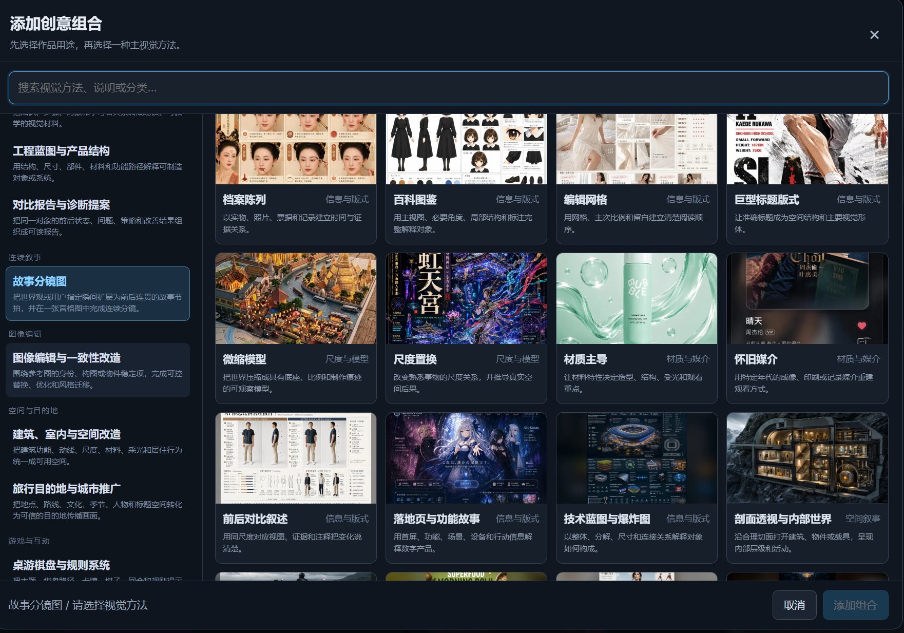
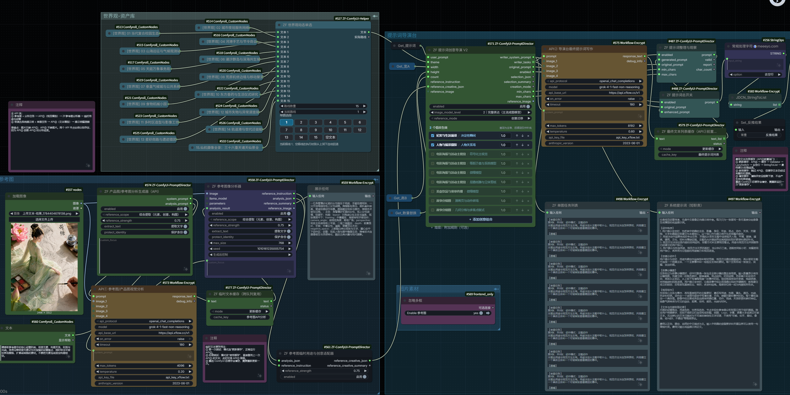

# ZF-ComfyUI-PromptDirector

[English](README.md)

## 插件作者 / Plugin Author

- 作者 / Author：**Z-C 小哩**
- B站主页 / Bilibili profile：<https://space.bilibili.com/474407516>

## 素材来源与致谢 / Material-Source Attribution

本插件图像导演台当前版本以及后续更新中使用、整理和扩展的视觉用途、视觉创意方向、案例启发和相关图像提示词素材，来源于 **远古大呲花** 的素材整理与分享。本仓库已获得作者本人同意，在此明确标注来源。

- 来源作者 / Source author：**远古大呲花**
- B站主页 / Bilibili profile：<https://space.bilibili.com/59550296>
- 工程范围 / Engineering scope：本仓库负责插件代码和工程化整理，包括素材结构化、用途与视觉方法映射、提示词工作流适配以及 ComfyUI 节点实现。相关素材的原始来源和作者贡献仍归属于远古大呲花。
- 更新说明 / Update note：后续新增、补充或更新素材库内容时，仍会按照上述来源进行记录；如来源安排发生变化，将同步更新本节说明。
- 贡献边界 / Clarification：本节用于标注素材来源。除非另有书面约定，这不表示远古大呲花参与了本插件代码开发，也不表示其对插件功能、模型行为或下游生成内容作出保证。

> 范围说明：上述署名只对应图像导演台的视觉素材目录。Music3 音乐导演台的提示规范、时长逻辑、参考音频规则和节点实现由本仓库独立设计，与远古大呲花无关。

> 当前为公开测试版，欢迎使用不同的工作流、语言模型和图像模型测试，并通过 GitHub Issues 提交复现步骤、任务文本与预期结果。请勿在 issue 中上传私密图片、模型或密钥。

面向 ComfyUI 的多领域提示词导演台。目前包含用途驱动的图像导演台，以及 MiniMax Music3 音乐导演台；导演节点负责把用户意图整理成模型写作任务，实际模型调用由工作流选择本地节点或 API 节点完成。

本版新增“角色资产与多视角设定”用途，并强化产品图职责分工、对照分屏和单一镜头方案纪律；这些规则来自素材模板的工程化提炼，不会把具体风格包或模型专属语法硬塞进导演台。

第一次使用建议先阅读：[用途与创意推荐说明书](docs/用途与创意推荐说明书.md)。说明书包含常用任务的直接搭配、全部用途速查、特殊模式和常见误区。

## 快速接法与用法 / Quick Start



上图是当前推荐的本地模型导演台接法；API 版本见下方“双 API 测试接法”。下面是导演台中“用途 + 视觉方法”的分类选择器。每次先选作品用途，再选一种主视觉方法，点击添加创意组合。



### 基本用法

1. 将用户提示词接入 `ZF Prompt Director.user_prompt`。
2. 将世界观动态单选接入 `theme`。不使用世界观时，使用 `ZF-ComfyUI-Helper` 的“空文本”按钮，不要只把旧数字路线的文本框清空后继续使用。
3. 在导演台中添加一个或多个“用途 + 视觉方法”组合。通常第一组启用组合是主任务，后续组合是补充方向。
   “推荐搭配”默认开启：点击用途会自动选中一项合适的视觉方法，并把更适合当前用途的选项放在前面；关闭后可按原顺序自由浏览和手动选择。
4. 正常成图时，`reference_mode` 选择 **创意迁移**，让参考图创意、世界观和用途共同工作。
5. 将 `writer_system_prompt`、`writer_tasks` 接入语言模型写作节点，再把验证后的提示词接回原有成图路径。语义创意迁移时，采样器的 latent 使用 `EmptyLatentImage`。

### ZF本地多模态指令

`ZF本地多模态指令`是导演台插件自带的本地多模态入口。它依赖 `ComfyUI-llama-cpp_vlm` 加载模型，但不依赖 `ZF-ComfyUI-MultimodalAPI`，也不会调用网络 API。

- 把导演台的 `writer_system_prompt` 接到 `role`，把 `writer_tasks` 接到 `prompt`。
- 当导演台输出 5、10 或更多任务时，ComfyUI 会逐条调用本地模型，并保留同样数量的结果；节点不会把任务列表压成一条，也不会只取第一项。
- 可选接入 8 路图片和一路视频抽帧批次。图片保持比例缩放；视频输入只分析抽样画面，不读取音轨。
- `force_offload` 关闭时可减少连续多任务之间的重复装载；随后要运行大型成图或视频模型时可开启，以释放显存。

### 导演台流程辅助节点

- **ZF文本动态多路点选**：显示 1–32 路文本输入，按钮选择哪一路，执行时就只请求这一条路线；“空文本”按钮明确输出 `""` 和路线编号 `0`。
- **ZF 人像提示词生成器**：可复用于多种图像模型，不经过反推也能从可编辑素材目录直接随机并组装人像提示词。`数量` 为 1 时输出当前提示词；大于 1 时输出同等数量的提示词列表，第一条沿用当前选择，后续条目随机生成且保留所有锁定项，可直接驱动下游节点连续出图。添加界面支持首页项目固定、分段随机/锁定/停用和单项锁定；双击任意素材卡片即可原地编辑，“节点修复”可统一恢复内置原文。
- **ZF Music3 音乐反推导演**：把校园、武侠、戏剧唱腔、内容要求或已有歌词写成一次模型任务；支持 15–360 秒的常用预设、自定义时长和参考音频模式。自动模式默认生成中文歌词，只有用户明确要求英文才切换英文。
- **ZF Music3 结果拆分**：把 API 模型的一次返回拆成独立 `caption`、`lyrics` 和参考特征分析；前两路可直连官方 `MiniMax Music3 Text Encode`，并检查 Structured Caption 三段结构与官方歌词标签。
- Music3 推荐搭配 `ZF-ComfyUI-MultimodalAPI`：把导演输出的 `writer_system_prompt` / `writer_task` 接到 API 节点的 `role` / `prompt`，把可选 `LoadAudio.AUDIO` 接到 API 节点的 `audio`。API 节点需选择真正支持音频理解的闭源模型；Anthropic Messages 路径当前不接收音频。
- **ZF任意过滤器**：可接文本、列表、图片、张量、姿态、数字、布尔值、字典等任意 ComfyUI 数据。判断命中后可以输出真正的 `None`、空文本、原值，或删除指定普通文字后输出。
- `None` 用于让下游“任意切换”跳过该路；空文本表示这一路确实有输出，因此会在该路停止。二者用途不同。
- 两个新节点使用导演台专属内部类名，帮助插件中的原节点可以继续保留，同时安装不会发生类名冲突。

### 故事分镜图与普通用途不同

选择用途 **故事分镜图**，视觉方法推荐 **漫画页与动作转场**。它不是生成多张独立图片，而是生成**一张包含全部分镜的复合宫格图**。

`count` 只表示一张复合图中的准确有效分镜数。版式可以等分，也可以使用一个主格与若干小格；剩余版面只作为边框、留白或统一背景，不添加伪分镜，也不补纯黑尾格。

采样器的 latent batch size 保持为 `1`。导演台任务文本应出现“单张宫格分镜任务”、准确有效分镜数量、连续性规则和与所选视觉方法相符的版式说明。先检查这段任务文本，再判断成图模型是否执行成功。

故事分镜图主要用于故事策划、视觉审阅和版式参考，不替代高分辨率视频参考帧。需要用于视频时，应按分镜逐张生成完整尺寸的画面，以保留足够像素和角色一致性。

### 易错点

- 正常成图不要点 **参考图创意提取测试**。这是隔离/诊断模式，会主动清除静态用途和视觉方法；即使勾选了故事分镜，也不会参与该模式。
- 只选择 **几何分格与多焦点版式** 只是普通多焦点排版，不等于连续剧情分镜；要选择 **故事分镜图** 这个用途。
- 如果任务文本已经明确写出宫格，但最终仍是单一场景，才属于成图模型的指令执行能力问题，而不是接线问题。
- 语义参考图创意迁移不要把原图 VAE latent 接入 `KSampler`，否则会变成图生图或结构控制流程。

## V2 核心逻辑

创作顺序固定为：

1. **用户核心**：用户提示非空时，主体、数量、身份、年龄、地点、动作、关系、关键物、文字和画面目标先构成完整核心。
2. **用途收敛**：用途决定作品要完成的专业任务，并据此从取材主题中选择真正相关的素材和可兼容扩展。
3. **创意表达**：视觉方法决定空间结构、观看方式、构图逻辑和主要视觉看点。

用户提示为空时进入“主题创作”：用途先确定取材范围，视觉方法确定画面结构，再从主题中建立一个具体主体和一个单图事件。空提示是正常创作模式。

## 参考图像分析

`ZF 参考图像分析器`与世界观参考保持独立。它会把参考图交给已加载的多模态模型，提取主体和元素、构图与镜头、动作关系、材质色彩、光线氛围、文字版式以及可迁移的创意机制。`ZF 参考图临时用途与创意适配器`再把这些字段转换为本次图片专属的动态用途、视觉方法、创意锚点和元素素材库。

### 全 API 测试接法



上图记录了一次完整成功的双 API 测试：API①读取参考图并返回结构化分析，临时用途与创意适配器把它送入导演台，API②再逐任务写出最终生图提示词。

仓库同时提供当前本地模型接法图 `local-workflow-connection-v2.png`：`ZF本地多模态指令`可直接完成参考图读取与导演台多任务写作，后面继续经过相同的提示词整理、总开关、去空行、字符串转列表和结果展示链。一次测试只选择 API 版或本地版，避免同时保留第二个写作节点或另一条反推分支。

如果要让参考图分析和最终提示词写作都走 API，不要把一个 API 节点同时承担两个任务：参考图分析必须先完成，导演台才能把分析结果交给最终写作。使用两个相同的 `FOK Multi-Protocol Chat Vision API` 节点：

```text
参考图 ─────────────→ API①.image_1
产品图/参考图分析生成器.analysis_prompt ─→ API①.prompt
产品图/参考图分析生成器.system_prompt ──→ API①.system_prompt
API①.response_text ─→ ZF 参考图像分析器.analysis_result

导演台.writer_system_prompt ─→ API②.system_prompt
导演台.writer_tasks ─────────→ API②.prompt
API②.response_text ──────────→ ZF 提示词整理与观察.generated_prompt
```

`ZF 产品图/参考图分析生成器（API）`只负责生成 API① 的结构化视觉分析任务；它不是最终生图节点，也不应接到 API②。API② 不接图片，只负责把导演台任务写成成品提示词。两个 API 节点可以使用同一个服务和模型，但必须是两个调用，因为它们的输入、输出和先后阶段不同。

图中使用的 API 节点来自 [`comfyui-FOK_API_tools`](https://github.com/facok/comfyui-FOK_API_tools)。接线时注意：

- API①的模型必须支持图片输入；API②只需要文本能力，四个图片接口保持空置。
- 测试时建议两个 API 的 `on_error` 设为 `raise`；分析使用约 `4096` tokens、`0.2` 温度，最终写作使用约 `8192` tokens、`0.5–0.7` 温度。
- `api_key_file`只填写 API 节点目录中的本地密钥文件名，绝不把密钥正文写入工作流或提交到仓库。
- 使用 xFlow 时，OpenAI 兼容协议对应 `https://api.xflow.cc/v1`；更换供应商时，协议、地址、模型名和密钥文件要成套修改。
- 分析生成器与参考图像分析器的`分析范围`、`参考强度`、`提取文字`和`保护身份`建议保持一致。API 模式下的补充关注点优先填写在分析生成器的`custom_focus`。

### 反推文本临时复用

工作流中的 `ZF 临时文本缓存（跨队列复用）`用于 A/B 测试反推结果：

1. 第一次运行把模式设为 **更新缓存**，正常让 API①或其它反推节点输出一次文本。
2. 后续把模式改为 **使用缓存**，节点会直接返回本次 ComfyUI 后台进程中保存的文本，并通过懒执行跳过上游反推/API①。
3. 需要换一份结果时再次选择 **更新缓存**；需要清除当前内容时选择 **清空缓存**。

这是进程内的临时缓存，重启 ComfyUI 后会清空。KJNodes 的 `SetNode / GetNode` 是前端虚拟接线节点，适合整理长距离连线，但不是跨队列文本记忆；要复用上一次反推结果，请使用这个缓存节点。

最终写作节点与提示词整理器之间另有 `ZF 最终文本列表缓存（跨队列复用）`，提示词整理器再把结果送到最终展示区。它保存的是整组多任务成品提示词，不会像单文本缓存那样只留下最后一条；先“更新缓存”，再“使用缓存”会跳过上游的 API②或 `ZF本地多模态指令`，直接把上一组结果送入后续整理和展示。旧的提示词总开关、字符串处理和字符串转列表链仍保留给二次反推与兼容测试使用。

最终文本列表缓存是最终写作节点后的闸门，不会替代后面的整理链：**更新缓存**会运行 API②或 `ZF本地多模态指令`，并继续经过验证、去空行、字符串转列表和最终展示；**使用缓存**会跳过该上游写作节点，后处理链仍然完整执行；**清空缓存**会安全阻断该分支，不会把空列表送进切换节点。

推荐连接方式：

```text
加载参考图 ─────────────→ ZF 参考图像分析器.analysis_json
                                      ↓
                           ZF 参考图临时用途与创意适配器
                                      ↓ reference_creative_json
世界观 / 空文本 ─────────────────────→ ZF 提示词创意导演
用户提示 ────────────────────────────→ ZF 提示词创意导演

多模态模型（LLAMACPPMODEL） ─────────→ ZF 参考图像分析器
EmptyLatentImage ────────────────────→ KSampler
```

参考图节点默认采用“综合提取（元素、创意、构图）”。可以切换为只提取主体、构图、材质色彩、文字版式或创意关系，并调整参考强度。`保护身份`开启时，人物脸部、姓名、品牌 Logo、商标和原图独有文字会被标记为不可复制内容。若不连接 `llama_model`，节点仍会输出分析任务，可将已有 VLM 节点的结果接入 `analysis_result` 后继续格式化。参考图专用分析会把温度上限收敛到 `0.2`，并能从未闭合的残缺 JSON 中逐项抢救已经完整输出的字段。

创意迁移工作流不要把参考图 VAE Latent 接入采样器，也不需要连接导演的 `reference_image`。这样参考图只作为语义素材库，不会退化为洗图、ControlNet 或图生图结构控制。只有明确需要复刻原图姿态、深度或像素结构时，才另行把 `reference_image` 接到 IP-Adapter、ControlNet 或图生图节点。

参考图中的具体字词不会自动进入成图提示。适配器只保留文字位置、密度、笔触和版式层级，并把内容写成不可读的装饰性文字纹理；用户在 `user_prompt` 中明确要求的文字仍然优先执行。

## 工作流结构

```text
用户提示 ─┐
取材主题 ─┤
宽/高/数量 ┤
用途/创意 ─┤
           ↓
ZF 提示词创意导演 V2
  ├─ writer_system_prompt → 语言模型 system_prompt
  └─ writer_tasks（准确数量的任务列表）→ 语言模型 custom_prompt

语言模型逐任务输出
  ↓
ZF 提示词整理与观察
  ↓
ZF 提示词总开关
  ↓
工作流原有字符串列表与出图分支
```

V2 不再使用模型生成的大型蓝图 JSON，不解析模型输出列表，不执行生成后语义修复。任务数量由插件程序建立，因此语言模型每次只负责一张图、一条提示词。

旧版的“视觉蓝图解析器”和“单图写作任务”仍保留为节点兼容入口，V2 工作流无需连接。

## 两种创作模式

### 用户执行

用户提示给出画面核心。用途从主题中收敛素材，视觉方法组织表达。用户需求与用途、创意天然匹配时完整结合；适配空间较小时，成品仍以用户核心作为主体。

### 主题创作

用户提示为空。用途决定从世界观中选择何种对象和信息，视觉方法决定如何呈现。每个任务使用不同的正向变化方向，形成不同事件、关系、环境、尺度、材料或用途焦点。

## 成图模型理解等级

- **1｜核心清晰**：直接动作、少量强相关细节，适合轻量成图模型。
- **2｜完整表达**：完整核心、主题素材和一个主视觉方法，适合主流成图模型。
- **3｜精密制作**：制作级人物、空间、版式、材料与光线描述，适合强语义模型。

等级控制成品提示词的信息密度，不绑定语言模型或成图模型。提示词长度由用途和等级共同决定，分辨率只参与画幅构图。

## 案例蒸馏数据

插件第一版目录来自 `GPT_IMAGE2_PROMPT_SKILL.md`、`GPT_IMAGE2_提示词指导规范.md` 和 1800+ 页案例库：

- `data/purposes.json`：32 个用途，覆盖人物、编辑、产品包装、品牌、角色与标准多视角资产、游戏、图像编辑、空间建筑、旅行餐饮、汽车、音乐、数字产品、教学、工程、桌游、展陈、系列内容与参考图临时用途；每项包含主题取材焦点、专业目标和展开维度。
- `data/visual_methods.json`：38 个视觉方法，覆盖叙事、符号、信息版式、材质媒介、尺度模型、技术图、UI、纸雕、拼贴、复古印刷、地图、流程表达与参考图创意迁移；每项包含空间结构和落实方式。
- `data/writing_grammar.json`：12 个正向变化方向，用于多任务差异化。
- `data/default_combinations.json`：默认常用组合。

所有目录均为可扩展数据，增加用途或视觉方法不需要修改前端节点主体。

完整世界观库属于独立创作资产，不随插件仓库提供，也不由 Git 跟踪。请将世界观保存在仓库外部的本地资料库或工作流中，再把输出接入导演台的 `theme` 输入。仓库仅保留一份公开的指导性示例：[`examples/定格世界.txt`](examples/定格世界.txt)，用于展示推荐结构、姿态物理关系和故事分镜约束，不作为内置世界观目录加载。

## 总开关

关闭时，`ZF 提示词总开关`通过懒执行直接传递原始用户提示，增强分支不会请求语言模型执行。

## 更新插件

修改代码或数据后，将整个插件文件夹同步到 ComfyUI 的 `custom_nodes` 目录，重启 ComfyUI 并刷新浏览器页面。
