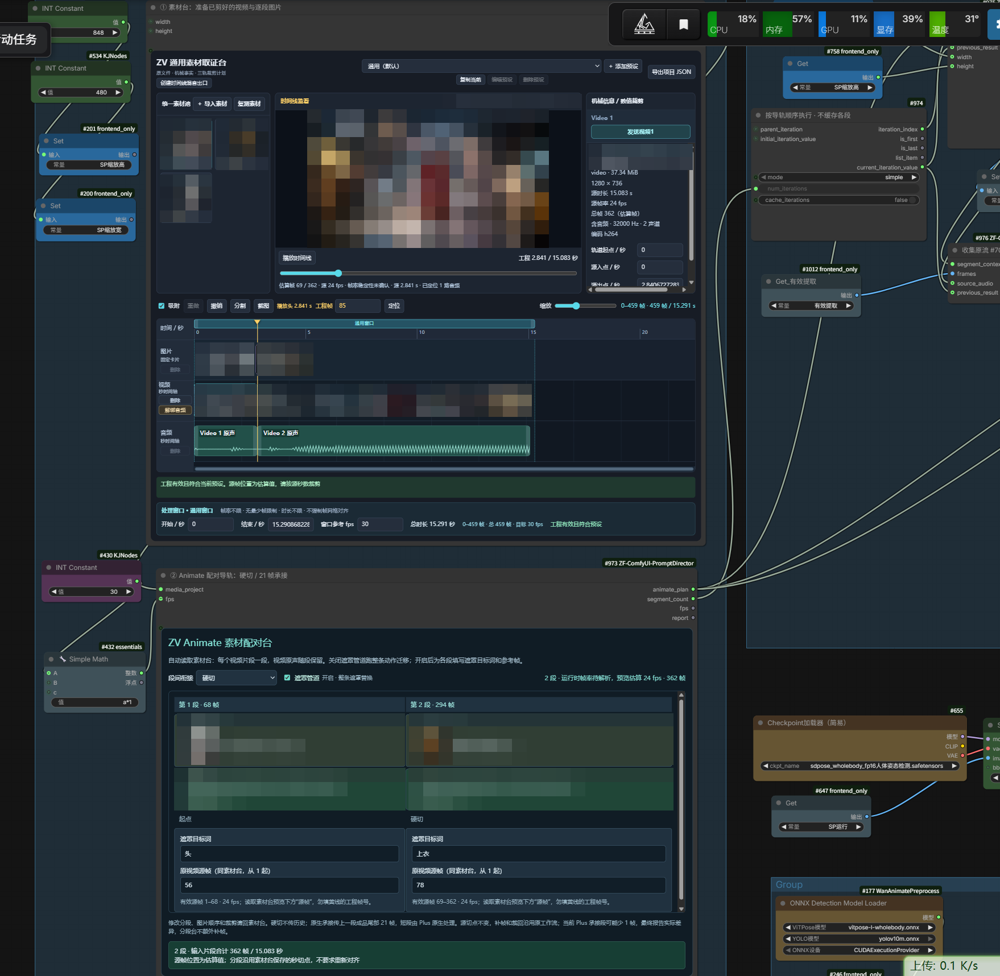

# Animate 原流附加一次成片

截图仅展示界面布局；演示素材、切点和参数不代表推荐配置或云端验收。

沿用原工作流的补帧、裁回、姿态、人脸、SAM/SeC、模型和采样链。新增方案接替素材入口与逐段遮罩参数，控制遮罩分支是否执行，从原 `#700 ImageFromBatch` 收集逐段成品，顺序合并。

## 环境要求

ComfyUI 必须提供原生 `StartLoop`、`EndLoop`，且 `EndLoop` 支持 `terminations` 支路；只有旧版循环节点的环境不适用。还需 VideoHelperSuite、WanAnimatePlus 及原工作流已有的全部节点和模型依赖。此附加方案不替换或打包这些依赖。

## 使用

1. 在素材台准备已剪好的视频与图片，按从左到右一段视频配一张图片。
2. 分段台选择硬切，或固定 21 帧承接。帧率、宽高沿用原工作流。
3. 顶部只有一个“遮罩管道”总开关：关闭跑整条动作迁移；开启跑整条遮罩替换，并在各段填写目标词、参考帧。
4. 运行一次，由原生循环顺序执行原流。循环结束后分别保存真实完整成片、以及原视频与完整成片的对照视频；竖屏左右排列，横屏上下排列。

最终合成节点 `#978` 的“输出质量”默认保持旧 H.264 8 位编码。可按播放端兼容性选择 BT.709 高画质 H.264，或需要云端 `libx265` 的 BT.709 H.265 10 位档；`#979` 保存节点的格式和编码保持 `auto`，才能直接封装已编码成片。`#998` 对照视频是另行编码的查看用文件，不作为成片画质母版。这些选项不改变 Plus 采样步数，也不能恢复分段缓存已量化的 8 位 RGB 细节。

Animate 不使用 H3 的 15 秒单段或总任务限制：一段超过 15 秒、或多段合计超过 15 秒，都按素材台实际切段逐段处理。配对台显示的“输入片段合计 X 秒”只是当前素材时长，不是上限；若状态变红，应看其后的具体错误（例如视频段数与参考图片张数未一一对应）。素材文件、工程时间轴和设备内存仍有资源安全边界；这不等同于模型的 15 秒生成限制。

参考帧填写素材台预览下方的“源帧”读数，从 1 起算；它不是黄线的工程帧号。各段显示该源视频可填范围，不导出或另存参考图片。填写内容绑定视频片段 ID 和源素材，调整顺序后随片段移动；更换素材或把参考帧剪到段外时会提示重新填写。动作迁移模式隐藏这些字段，保留填写内容供切回遮罩模式使用。

内部将源帧时间换算为当前 VHS 批次的局部帧，再加原 `#712` 的前补帧数；该索引同时送给 `#523` 取图与 `#367` 的 SeC 标注输入。Plus 的 21 帧承接发生在后面，不加入这里的索引。不同帧率按原 VHS 重采样网格换算，原素材切点不移动。旧 `#304/#461` 的全局常量不再控制一次成片。

遮罩关闭时，懒执行开关向 Plus 的 `mask` 和 `bg_images` 返回空值，SAM、SeC 及目标词翻译分支均不执行；显存清理支路也经过该开关。开启时沿用 SAM → 手绘种子合并 → SeC → 固定遮罩合并 → 原后处理，SeC 前检查有效种子；空检测会报告具体段、源帧和目标词，便于修改后重跑。

原 `#437/#784/#467` 手绘旁路仍保留原有启停状态，本次未新增逐段手绘编辑器；手动启用旧手绘输入后仍会共享到各段，需要确认画面坐标与用途都适用。不要把某一段专用的手绘遮罩用于其他段。

本模板新增的空素材台按原 `#430 → #432 a*1 → 帧率预设` 初始化帧网格（当前原流为 30 fps），运行时仍由原帧率接线决定。不修改原帧率或任何已有秒切点；配对台只在执行计划中把秒切点换算为 VHS 所需的整数 `skip_first_frames` 和 `frame_load_cap`，不要求用户再次对齐。探测得到的 `30.000001` 这类整数帧率浮点噪声按 `30` 处理，不视为重采样。

源帧率与工作流帧率相同时，入口以 VHS 的 `force_rate=0` 逐帧读取原视频，避免微小帧率差触发丢帧。确有帧率差异时才启用原 VHS 重采样；实际读入帧数仍须与选定范围一致。

首段和硬切不输入过渡图像；承接读取上一段已裁回成品的尾 21 帧，交给 Plus 原本的 `transition_video` 输入。21 帧不是额外叠化长度，合并时不再扣除一次。

原文件不改。新增副本中的旧单段保存和无关旧素材预览暂设为 Mute，防止重复保存及旧文件缺失阻断运行。节点和参数仍在。素材原接线、遮罩原接线与暂改模式分别记录于 `extra.zv_animate_once.original_links`、`original_mask_links` 和 `original_modes`。

遮罩开启时保留两处观察：种子检查节点显示参考帧原图、绿色覆盖和黑白种子（从左到右）；遮罩开关节点播放实际送入 Plus 的完整背景视频。两处随当前段更新，不改变遮罩；关闭总开关时不会执行 SAM/SeC。旧 `#284/#515` 保持静音，避免独立预览根重复拉起循环。若种子预览已漏选，检查目标词/参考帧；若种子正确而背景视频漏选，再检查 SeC 追踪和后处理。

原显存清理节点保留其原有启停状态；当前用户副本中的清理节点是绕过状态，附加层不会擅自开启。旧草稿曾把已绕过的清理/预览输出接入循环结束口，经转换后变成对姿态、Plus 和遮罩等上游节点的重复索取；修复副本清除这些冗余连接。原姿态绘制 `#644` 仍接一条显式循环依赖：`#554` 的 rgthree 动态切换输入不会被 Comfy 的循环验证器自动追踪；这条接线只固定循环边界，不改变姿态图像或选路。

循环内旧 VHS 视频保存/预览输出保持静音，不再作为独立输出根。旧 `#78/#109` 的残留视频预览缓存会在新副本中清除，其他参数保留。最终帧数与原声音频报告由合并节点显示，旧独立报告节点也保持静音。循环后的第一处 `SaveVideo` 保存真实完整成片；对照节点只接该已保存成片和素材计划，从成片所属运行目录读取已校验的分段清单，再由第二处 `SaveVideo` 保存完整对照。对照节点不直接连接 `EndLoop`，不会为保存对照额外索取循环结果。两处最终保存节点位于旧输出区右侧。

若 Comfy 因内存压力丢弃一次循环的中间缓存，录制节点在同一任务、同一段再次被索取时，会先核验磁盘上的清单与分段文件；有效则直接返回已录制结果，不再请求原流成品帧。不同任务或文件变化时不能复用。此措施不改原 Plus、SAM、SeC 或采样节点，也不证明实际 GPU 全流已验收；仍须以真实运行日志核对每段只采样一次。

新增副本打开时定位到上方素材台和配对台；原节点不移动，原视口记录在 `extra.zv_animate_once.original_view`。

## 帧数边界

当前 Plus 的 21 帧承接路径存在对齐后少 1 帧的情况。此附加方案不修改 Plus，也不复制尾帧补足；按实际输出帧数合成，报告目标与实收差异。因此承接模式目前不承诺逐段输出帧数与输入完全相等。硬切不经过这条过渡扩展分支。

素材台已确认的视频切点不移动。原声按每段实际成品时长尾裁或尾补静音，不重复上一段音频，也不拉伸变速；采样率统一到 44100 Hz。若所选范围已无剩余原声，VHS 可能无法读取该段音轨；入口会在本段 GPU 生成前提示检查原声或在素材台停用该段原声，停用后该段输出静音。

中间片段转为 8-bit RGB 后无损缓存，避免分段缓存再引入有损压缩；默认最终成片只做一次 H.264 有损编码。

已验证三段真实 Comfy 原生 CPU 循环：硬切/21 帧承接 × 遮罩总开关开/关四种组合，在 RAM pressure 缓存策略下每次只建立一个运行目录并保存一份成片。另有节点级回归覆盖录制结果复用和双输出对照；这些测试不能替代完整 GPU 流程的验证。检测、跟踪和采样使用替身，原 VHS 读取、索引转换、种子检查、懒执行开关、完整背景视频预览、循环、录制和合并为真实实现；关闭时检测/跟踪执行次数为零。云端 GPU 成片尚未验收。

2026-09-24 本地另用原模型链完整跑通两段硬切＋遮罩开启的任务：录制日志各段恰好一次，分别为 114、241 帧；最终保存节点得到 355 帧、30 fps 的真实成片和 355 帧左右对照，二者均有一条 44.1 kHz 双声道音轨。该结果证明这一份素材与参数的执行、合并、双保存链路可用，不代表所有分段/模型配置或遮罩画面质量均已验收，更不等于云端已部署。

云端更新并重启后，先在 `/object_info` 确认 `ZVUniversalMediaEvidenceDesk`、`ZVAnimateSegmentDesk`、`ZVAnimateExecutionEnd`、`ZVAnimateFinalComparison` 均已注册，再确认浏览器无本插件模块资源 404 或 `Error loading extension`，新建与已保存的素材台都能显示。完整对照节点仅在实际制作对照时需要 OpenCV；插件启动和其它节点注册不依赖它。云端完整运行仍需原流的 VHS、SAM/SeC、Plus 和模型环境，应用低步数/低分辨率副本实测，不以节点出现代替成片验收。

## 生成副本

`tools/add_animate_once.py` 接受原工作流 JSON 和一个尚不存在的输出路径，拒绝覆盖任何已有文件。新增素材台默认为空；旧节点的原有控件值完整保留。

已有一次成片工作流可用 `tools/add_animate_once.py 输入.json 输出.json --repair-loop` 生成独立输出副本。它静音循环相关的旧视频输出和独立报告，规范 EndLoop 动态端口，补上姿态分支的显式循环依赖，并保留已填素材、切点、遮罩参数与模型设置。这减少旧输出根，但是否消除实际 GPU 重算需看运行日志，不能仅凭静音节点断言。插件代码更新后需重启 ComfyUI 再运行修复副本。

已有副本恢复遮罩观察可用 `tools/add_animate_once.py 输入.json 输出.json --restore-mask-previews`。它补接种子参考图，并将完整背景视频预览转到必经的遮罩开关节点；旧 `#284` 保持静音，素材、模型参数与翻译设置保留。

已生成的一次成片副本也可用 `--repair-loop` 另存新文件，使最终 `SaveVideo` 出现在旧输出区右侧，并清除已停用 `#78/#109` 的旧视频缩略预览；已有文件不会被覆盖。
