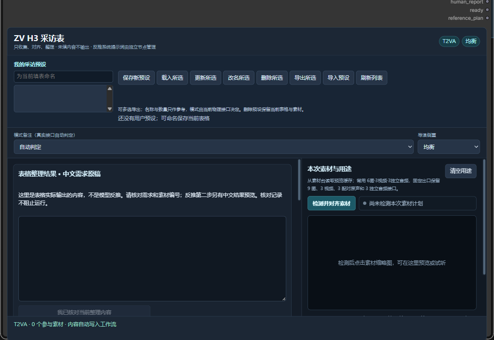

# H3 采访表与独立反推



截图展示空表与素材用途区域，不代表已完成素材对齐或反推。

当前只有 `ZVH3InterviewFormV2` 一套采访表。旧基础采访表、旧结构化计划编译器与旧表的四个提示词出口已删除，不注册别名。旧工作流需换用当前模板；用户原工作流文件不会被自动改写。

已有完整提示词时，可使用 **ZV H3 提示词 · 素材对齐**（`ZVH3PromptInput`）。它提供触发词和提示词两个文本框，保留素材选择与对齐功能，适合直接生成或继续交给反推模型整理。

## 使用说明与限制

常规生成窗口为 **4–30 秒、24 fps**。超过 15 秒显示黄色提醒并允许继续；所接生成节点、模型和可用资源决定实际能否完成，表格放行不保证成片。分段采访仍按每段 2–15 秒检查。

先把需要的素材放入素材台轨道，在右侧勾选“参与 H3”与参考用途，再点击“检测并对齐素材”。文字引用右侧显示的“本次 H3”编号；换素材、改裁剪或改变参与状态后重新对齐。

| 参考类别 | 数量 | 选段长度 |
| --- | --- | --- |
| 参考图片 | 最多 9 张 | — |
| 首帧、尾帧 | 各最多 1 张 | — |
| 参考视频 | 最多 3 段 | 每段 2–15 秒，合计不超过 15 秒 |
| 独立参考音频 | 最多 3 段 | 每段 2–15 秒，合计不超过 15 秒 |
| 视频原声 | 最多 3 路，随同源视频参与 | 每段 2–15 秒，合计不超过 15 秒 |
| 驱动音频 | 最多 1 段 | 2–15 秒 |

参与素材合计最多 12 项，视频原声不重复计入。首尾帧与参考素材同时使用、仅用音频或多路音频组合，需要所接生成节点支持相应输入。参考段使用素材台的源入点与源出点，生成窗口不会自动替你裁剪参考段。

需求写清要做什么、哪些内容保留或改变，以及动作、镜头和声音；没有要求的项目可留空。参考图与参考视频提供生成依据，不保证身份、动作或逐帧画面完全复刻。

换一轮需求时，点击“一键清空填写与勾选”：清空本次文字、用途、参与和参考用途勾选，不删除素材台的素材、轨道、裁剪或已保存预设。误点可“撤销清空”；恢复后重新检测并对齐素材，避免沿用过期接线。

纯文生视频时，取消所有素材的“参与 H3”，只写文字并重新检测对齐；生成节点需支持无参考生成。仅改模式备注不会取消已有素材。这里生成的是视频；单张图片使用图像导演及图像生成工作流。

## 已有提示词：直接生成或继续反推

**ZV H3 提示词 · 素材对齐**的 `trigger_words` 填触发词，`prompt_text` 填提示词正文；两者按触发词在前、正文在后拼接为普通文本，不自动添加反推规则或改写正文。

- 直接生成：将 `prompt` 接到 H3 工作流的文字提示词输入。正文应使用所接模型接受的提示词格式；此节点不替代模型的文字编码或采样。
- 继续反推：将 `prompt` 接反推节点的用户文字输入，将 `material_context_json` 接素材事实输入，再把反推结果接生成工作流。
- 有参考素材：将 `reference_plan` 接 `ZVH3ReferenceOutlet`，出口的图片、视频、音频接生成节点对应输入。文字引用和素材输入必须使用同一份对齐结果。

七个输出依次为 `prompt`、`material_context_json`、`duration_seconds`、`interview_json`、`human_report`、`ready`、`reference_plan`。与采访表的素材出口相同；是否调用反推由下游接线决定。

## 表格只做收集、对齐、整理

表格保留用户填写的原文，空白要求省略，不补剧情、镜头或声音。素材编号、参与开关、物理接口和源时间范围按当前工程对齐；物理接口由选择决定，不从文字猜接线。

七个输出依次为 `user_prompt`、`material_context_json`、`duration_seconds`、`interview_json`、`human_report`、`ready`、`reference_plan`。前两项分别是中文需求原稿与素材事实 JSON，不含反推系统提示词。

表内展示后端实际整理的中文原稿。点击核对仅记录用户已看过当前内容，不改写原文、不自动暂停执行。原稿或素材事实变化后需要重新核对。

## 三个独立模型阶段

| 阶段 | 输入 | 责任 |
| --- | --- | --- |
| 素材理解 | 原稿、事实清单、实际图片和视频抽帧 | 观察素材并对齐编号，区分观察与要求 |
| 中文意图整理 | 原稿、事实清单、第一步观察 | 整理成可核对的中文用户提示词 |
| H3 提示词生成 | 原稿、中文提示词、观察、实际视觉素材 | 按当前模式和独立预设写最终 H3 提示词 |

三个 `ZVH3ReverseStage` 各自输出 `system_prompt`、`user_task`，接到对应模型。系统词留空使用该阶段内置规则，填写后完整替换。第三步 H3 格式规则只属于反推节点，不注入表格。VLM 只有图片和视频抽帧，不会听取音轨；音频编号和用户用途不等于声音观察。

## 当前工作流

普通示例：[H3焦点访谈_普通.json](examples/H3焦点访谈_普通.json)。素材与用户要求留空；使用前核对并替换模板的模型选择，导入自己的素材。

四个文字预览依次显示表格原稿、素材观察、中文意图、最终提示词。默认运行继续第三步；不是必须用户参与的审批链。最后一个反推模型启用 `force_offload`，在 H3 采样前释放模型显存。

仅检查提示词时，从当前普通流生成独立副本：

```powershell
python tools/prepare_h3_workflow.py current.json --output full.json --prompt-only-output prompt-only.json
```

工具只接受当前三阶段链，拒绝覆盖源文件或既有输出。提示词副本保留节点和用户数据，但把四处预览依赖之外的节点设为 Never；不会执行视频采样、解码和保存。它不负责转换废弃接口。

固定素材出口的 `reference_plan` 接采访表输出 6。模板预接首尾帧、9 张参考图、3 路参考视频及其原声、驱动音频和3 路独立参考音频；换素材后重新检测即可。长视频也使用同一文字边界，见[长视频指南](LONG_VIDEO_GUIDE.md)。

更新插件后正常重启 ComfyUI 并刷新前端。程序测试证明契约与接线，不代替实际模型的中文理解、最终格式与成片质量验收。
